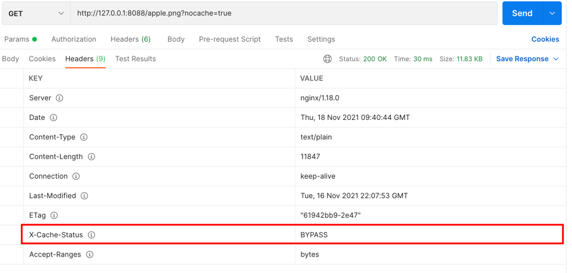
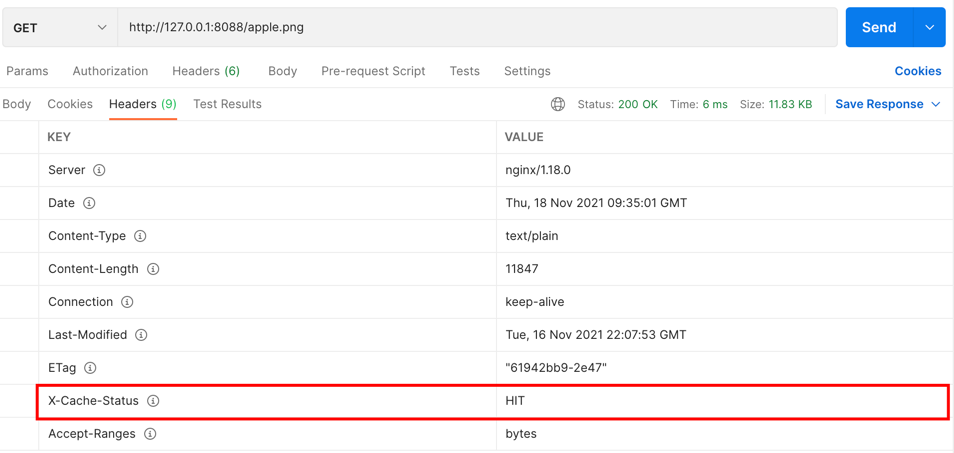

# nginx-media-cache
Tuning nginx to cache media files

### Cache statuses `$upstream_cache_status`
- 800: HIT
- 779: - (request never reached to upstream module)
- 392: BYPASS
- 19: EXPIRED
- 14: MISS

### Bypass cache
`GET http://127.0.0.1:8088/path/to/image?nocache=true`

Check header `X-Cache-Status: BYPASS`

### Get an image more than 1 time
Check header `X-Cache-Status: HIT`

